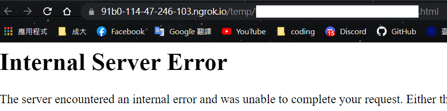
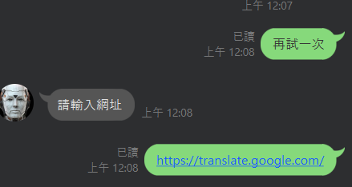

# TOC Project 2020
**伺服器測試機器人**
## 啟發
這個機器人的主題是小工具，主要是因為，當我們使用自己寫的 server 使用到 GET 以外的 HTTP Request method (像是 POST) 可能比較難 debug，所以我這裡提供一種方法，讓我們能使用聊天機器人幫你測試。

## 構想
首先這次作業規定使用 FSM,相信是為了符合計算理論的主題，根據[維基百科](https://zh.wikipedia.org/wiki/%E6%9C%89%E9%99%90%E7%8A%B6%E6%80%81%E6%9C%BA)的定義(如圖)，

我們只能使用上一狀態的 input，產生 output，這代表如果我們把 網址 當 input ,method 當 state，就沒地方放request header, body等等的東西了，但好在這個 linebot 只是要 debug。  
因為 heroku 不知為何無法安裝 `transitions`，所以自己做(山不轉路轉)，好在 python 有類似 function pointer 的功能，做起來部會太難。
## FSM
因為開發(本地)環境沒問題，所以圖是用 `GraphMachine` 畫的

> 如果下一 state 只有 else transition 會再跳下一個 state，類似 lambda transition
## 實際測試
本次作業剛好就會有 POST method 我們可以看一下收到了什麼


這個是因為程式碼把沒有 `X-Line-Signature` header 的 request 擋掉，所以 flask 顯示錯誤訊息。
```py
@app.route("/callback", methods=['POST'])
def callback():
    # get X-Line-Signature header value
    signature = request.headers['X-Line-Signature']
    # get request body as text
    body = request.get_data(as_text=True)
    app.logger.info("Request body: " + body)
    # handle webhook body
    try:
        handler.handle(body, signature)
    except InvalidSignatureError:
        abort(400)
    return 'OK'
```
**抓 youtube**


網址有被重新導向過  
**抓 facebook**


1. 可以看到有些地方沒有畫面，是因為爬蟲沒辦法抓 local dependence(像 css 檔，抓到的檔案 fetch 也沒辦法用)。
2. facebook 顯示登入畫面是因為爬蟲就像是沒有登入的使用者，除非有給 header。

## 難點克服
1. **傳送檔案太大**
我的程式主要是用來測試，所以爬蟲抓到的資料希望可以完整地交給 client，但訊息大小有上限，所以使用 dict 存放抓到的檔案，不同 user 根據 uid 有不同的 path ，那些就是他們的暫存區，當機器成功抓好網頁後會有超連結可以查看抓到甚麼。  
**超連結格式:** `https://[linebot 所在域名]/temp/[uid].html`  

2. **heroku 無法安裝 graphviz**
另外我的圖是 [draw.py](draw.py) 畫出來的，因為 heroku 似乎沒辦法安裝 graphviz 就算用了去年的方法，[環境](./Pipfile) 要分一下 ，dev-packages 是可畫圖的，而 packages 是推 heroku，而我的狀態機是採用 [構想](#構想) 的方法，寫在 [fsm.py](fsm.py) 裡  
## 功能展示
以下是主畫面

查詢機器人經過的 IP

測試伺服器，輸入請求


regular expresston 擋掉非法網址(ex. 域名有 + 號)

輸入翻譯的網站當測試


點 立刻查看，網頁被存到機器人所在伺服器域名的 temp path 內。

## regular expression
對於 http, https 網址  
`'https?:\/\/[a-zA-Z0-9\-]+(\.[a-zA-Z0-9]+)*(\/\S*)?'`  
我自己規定的，所以比較寬鬆。  
將 regular expression 分成三部份看，
`'https?:\/\/`, `[a-zA-Z0-9\-]+(\.[a-zA-Z0-9]+)*`, `(\/\S*)?'`  
第一部分代表 `http(s)://`，`s?` 代表 s 可有可無  
第二部分表示域名，大小寫數字皆有(我規定的)，子域名一定要有，子域名接受 `-`，  
第三部分代表 path, `/` 可有可無，`/` 後 path `\S` 接受所有字元。